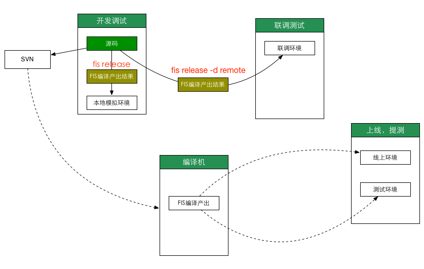

架构篇
==================

前端的难题不在于业务多复杂，而在于如何将其工程化。也就有了诸多利于工程化的工具，例如grunt、gulp、**fis**。

前端架构问题就是解决前端工程化的问题。以下这张表表述了一般一个前端项目的开发过程。

前端项目开发的过程大概是开发调试->联调测试->提测、上线；

- 开发调试

    为了前端开发和后端开发并行，所以在本地开发调试这块需要有一个模拟环境模拟线上的真实环境。这样就可以做到**前后分离**

    **FIS提倡源码放在SVN管理，而由工具编译产出的结果在运行环境运行，不放在SVN中管理。**

    FIS提供的本地环境模拟，包括数据模拟，URL转发，模板渲染。

    在开发阶段，会涉及以下工程问题

    - 源码维护
    - 静态资源合并
    - 静态资源压缩
    - CDN的使用
    - 强刷缓存方案

- 联调测试

    当开发完成后，需要跟后端进行联调，为了方便，开发工具会提供快速`deploy`数据到联调环境中功能。

- 提测、上线

    提测、上线这个环节，一般都是把编译产出打包，并发给测试或者上传上线。
    不过在百度内部是需要把编译产出放到产品库，由测试或者上线平台拉去进行测试、上线。
