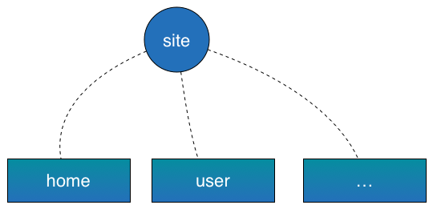
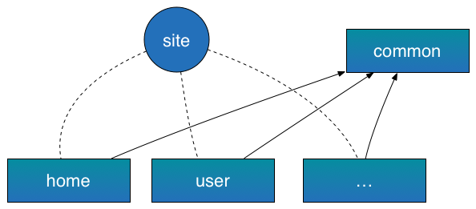

## 附录

### 目录规范

> 为什么要指定目录规范，如何指定目录规范是合适的，移动、pc都需要关注。

随着团队、项目越来越大，代码也随着变多。维护一套统一的目录规范是很重要的。统一的目录结果有很多好处，除了方便维护还可以通过工具来做一些自动化的工作。

在整个站点中，业务扩张后可能分为若干个子系统，比如用户子系统、支付子系统、分类子系统等。为了业务迭代，一般都会子系统单独功能升级，当然代码也就得按照子系统划分。假设我们把一个子系统的代码维护在一个svn下，并且用一个模块来标识一个子系统。这样一个站点就由多个子系统构成。

代码按照模块来维护，比如`common`、`account`等。

这样我们的一个站点的代码功能组织结构如下图；



当代码分成模块后，发现有些代码各个模块都需要用，那这个时候就会出现一个`common`模块来负责关心公共部分的代码。

当后续上线的时候，其他模块依赖于`common`模块即可，比如当给用户子系统添加功能时，抽象出了一些公共组件或者功能模块需要放到`common`里，那这时候上线的时候就需要关心两个模块`common`和用户子系统模块。

具体示例图如下；



上面已经说过，一个模块代码放入一个SVN仓库是比较理想的，这样一来模块就可以独立进行开发，不与其他模块相互牵扯，还可以减少代码分支合并冲突。

一个站点的代码分成多个模块进行维护，那模块里面应该怎么样组织会比较好一点呢？

在说明模块的目录规范时，需要引入`组件`的概念；组件就是一个功能或展现块。比如一个搜索框、一个导航抑或是专门负责地理位置处理的逻辑功能块。

一个页面可以分成若干组件，这时候目录就可以指定为；

- page
- widget

page下放置页面模板，而widget下放置所有的组件。page中include各个组件来拼出一个完整的页面。组件里面可以包含图片、js、css、模板等静态资源。

可能还会用到第三方库，比如`jquery`比如`960`，或者网站的ICO文件，这些放到组件里面可能不太合适，所以一般会有一个`static`目录来负责这些资源。

- page
- widget
- static

这样，模块内的目录结构就成型了。

```bash
.
├── page
├── static
└── widget
```

上面没有提到的几个问题；

- page里面是否需要放静态资源？

    一般来说，page里面都是一些页面模板，而会把一些用到的静态资源放到`widget`或者`static`下面。

- 展现块和功能块都包含那些静态资源？

    展现块包括模板，修饰模板的css还有js或者图片等叫`模板组件`，而功能块则是一些js、css、图片叫做`JS组件`。当然只有css和图片的组件叫做`css组件`

### 组件化

> 组件化或者模块化

站点拆成了模块，模块拆解成了很多页面，页面又由若干组件组成。这样的一个结果确实对维护很友好，就像拆解函数一样，每一个组件都做一项职责单一的工作。

当功能被拆分为各种组件，则会面临两个问题

0. 拆分成组件，务必会导致多了很多分散的静态资源文件，也就多了很多浏览器请求。
0. 为了复用性，可能需要提供一种机制搞定组件之间依赖的问题。就好比定义了好多函数，函数之间互相可以调用的方法。

#### JS组件

对于第一个问题，不得不对多个小文件进行合并。当合并的时候问题就出来了，JS代码变量发生冲突了，可能还会出现依赖顺序问题。每次需要通过精确的打包顺序和以及严格的变量命名规范才能搞定这个事情，当然规范的这种方式就显得太拙劣了一点，因为我们没办法保证每个人都会遵循规范。

干脆直接把代码写到一个匿名的`function`里面；

```javascript
(function() {
    var f = 0;
    ...
})();
```
这样解决了变量冲突的问题；

对于第二个问题，组件之间依赖的问题，可以效仿`node`的做法。在node里面，使用`require`来引入使用另一个组件。比如有a，b两个组件；其中a组件依赖b组件。这时候，在a里面就会这么写。

```javascript
//a.js
var b = require('b');

b.init();
b.run();

```

```javascript
//b.js
exports = {
    init: function() {

    },
    run: function() {

    }
};
```
其实对于每个组件，node会包裹一层函数，也就是上面提到的方法，不过为了解决更多的问题，包裹的方式不太一样。

实际上`b`组件应该是这个样子的。

```javascript
(function (exports, require, module, __filename, __dirname) {
    exports = {
            init: function() {
            },
            run: function() {
            }
    };
});
```

仔细看，就会发现这个`function`没有自执行。一般都是当`require`这个组件的时候再执行。进展到这儿可能需要理一下头绪了。

> 为了复用性和维护性 -> 拆解组件 -> 组件依赖、合并问题 -> 定义组件、引入`require`

基于node的思考，前端js组件也是可以使用相同的思路。组件包裹`function`然后在另一个组件里面用`require`来调用这个组件。现在有很多这类的规范，比如amd、cmd，也有很多实现require.js，mod.js，sea.js等。

而唯一不同的是，定义组件引入`define`函数；可以参见[AMD规范文档](https://github.com/amdjs/amdjs-api/blob/master/require.md)。

定义组件是这个样子的；

```javascript
define(function (require, exports, module) {
    //the require in here is a local require.
});
```

这样定义组件，可见的一个问题就是无法辨别组件，因为都是匿名函数，不可分辨。唯一能用来标识的就是文件的路径。但是这些文件是要合并到一起的，所以文件路径也不好使。好在有很多方法可以解决，可以参见AMD规范。

FIS `mod.js`的做法。

```javascript
define (id, function (require, exports, module) {
    //
})
```

用唯一的`id`标识每一个组件。明显，当JS组件都合并到一起后一点问题都没有。就像定义的一个个函数，给每一个函数取上了不同的名字，它们是唯一的存在的。

当然，这时候你会问，唯一的名字不也需要通过规范来写吗？当然不是，这会需要换一种思路来解决这个问题，工具自动根据路径来生成一个ID，轻松搞定这个问题。有自动化工具的接入，直接解决ID可能冲突的问题，当然必须这也是FIS的一个特色。

#### css组件

当然了，css的合并就显得轻松多了。因为它不会出现变量冲突直接挂掉页面，唯独有的就是可能选择器相同导致样式覆盖，但这个问题还是很容易解决的。加个统一的前缀了，使用less等变种语言啦。都可以很好的解决。

css组件依然需要关注的是，依赖问题。其实有的时候，css也是需要依赖的，至于为什么，后面会详细讲到。

css依然可以通过提供`require`来解决。比如，FIS的核心三种语言里面的。

```css
/**
 * @require a.css
 */
```

#### 模板、html

模板可能就不会遇到合并的问题了，所以依然是依赖问题比较明显一点。在整个解决方案中，我们选择提供的是Smarty模板。方案中使用Smarty插件的机制，提供了一种调用其他组件的方式。

```smarty

```

这样，就能很简单的调用其他组件了。