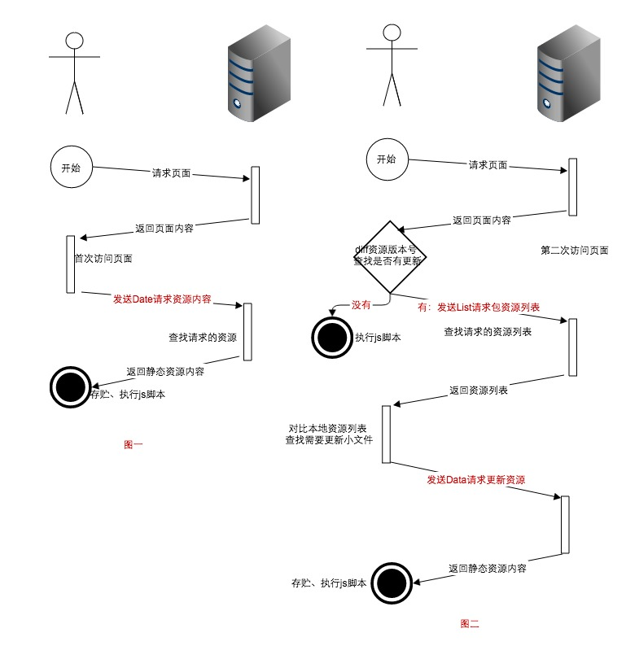

## 缓存使用

> 缓存使用...

### 基于localStorage的静态资源差异化更新

> 增强缓存利用率，有效的减少请求资源大小

localStorage 作为浏览器端本地存储的手段，其高效瞬存瞬取已经被世人所知。如果使用它来做静态资源的缓存，能使缓存使用率提高很多。一般浏览器的缓存大概在60%左右，但由于需要合并资源，可能其中一个文件改变就导致整包加载，缓存失效。本节主要介绍如何用`localStorage`来做资源的差异化更新，也就是解决上面遇到的这个问题。

可以再瞄一下上面的描述，为了`减少请求`需要打包，包文件在包含的任何一个资源发生变化后就会导致整个包需要被请求一次。这种情况很容易出现，这在快速迭代时更明显。

对于这个问题，本方案的解决方式是用`localStorage`保存静态资源的内容。这块的内容不是讲整个内容保存进去，而是被打包文件内容的列表，每条内容附带一个版本号；有了这个版本号，就可以一定的方式`diff`出需要变更的资源。然后请求回来更新`localStorage`的缓存。

大致就如文字描述，但是里面有很多细节，以下是整个方案的详细实现。

- 图一是当用户首次访问没有缓存的资源更新流程

    从图一中可以看出首次访问的用户资源更新需要发送1个请求

- 图二是非首次访问用户的资源更新流程

    从图二可以看出非首次访问的用户资源更新需要发送0个或者2个请求

上图描述了整个方案的细节，可以看出，通过前端`loader`来接管资源的渲染、加载。即可引入`localStorage`存储阶段。