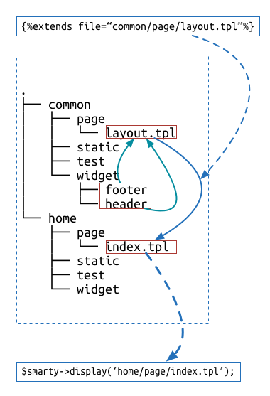

## 资源请求控制

> 开说之前，先说一下约定，我们默认都知道[FIS][FIS]，并且使用[FIS][FIS]。

在开发Web应用（包括移动）时，都大概会有几类；

- A类，项目不是很大，粗暴的以文件类型组织自己的代码，代码象征性拆分成了若干文件。后在使用的时候，直接合并这些资源，在页面加载合并后的资源。
- B类，项目庞大，开发人员需要协作才能完成，代码按照组件的方式拆分。组件包括一个完整的展现或者是逻辑，比如页面头部，包含html、js、css以及图片，这些资源被放置到一起成为一个组件。

A类大概没有什么好说的，因为代码文件足够小，所以直接打包成一个文件即可，相信也没有太多的迭代。我们主要关注的是B类。

可能这块有人会问，为啥要拆分组件，这个原因就是不想一个文件里面有太多行代码，不好维护；而且不想拆分的代码没有什么实际意义。言归正传，我们的前提是已经做了组件化拆分的站点的请求控制。代码为了维护拆分组件会有一堆散列文件的出现，出现后在请求是为了节省请求个数会进行合并。我们就从`资源合并`开始说明移动上该如何做比较合适。

### 资源合并

> 根据不完全统计，移动端页面请求的时候请求的资源个数越少约好

**越少**，看来我们的目的是要把资源合并的“越少”，大家可能发现了我在这里加了引号，可能都猜到了，这个**越少**也是有玄机的。

一般一个复杂的web应用有好几个页面，每个页面的展示元素不尽相同，这样它们使用的css、js代码都是不一样的。那么，为了达到**越少**，很容易想到的办法就是按照页面合并。




上图展示了一下，一个前端FIS项目的[目录规范]()，关于它的细节可以参见[fis-plus]()解决方案，如果你开发的是移动端的应用需要选用她。从上图可以看出，我们渲染的目标`home/page/index.tpl`扩展了`layout.tpl`，而`layout.tpl`又使用了两个组件`header`、`footer`。

那么，我们的目标是针对于`index.tpl`这个页面进行打包，那打包结果是；

- `common_index.pkg.js` 合并`common`模块被`index.tpl`引用的静态资源
- `home_index.pkg.js` 合并`home`模块被`index.tpl`引用的静态资源

FIS项目中，跨模块的静态资源使用是不被允许的，具体原因参见[文档]()，所以同种资源（js、css、iamge）我们最少能合并成两个包。

现在考虑一个新的情况，假设`home`模块还有另外一个页面`B.tpl`，而恰巧使用的资源跟`index.tpl`有重复的（重合的资源是`home`模块下的）。如果还是按照上面的合并方式，就会导致某些资源同时被多处合并的情况。这样的结果导致这些资源无法使用`缓存`，`index.tpl`和`B.tpl`无法共享`缓存`。

暂且先不关注`缓存`了，因为我们第一个目的已经达到了，**页面请求资源数量达到最小**。

但是我们又不得不关注缓存，而且缓存至关重要。所以在FIS里面同一个资源是无法合并入两个包的，除非你使用黑魔法，直接内嵌！

这时候，合并的方式就有了变化；

```javascript
fis.config.set('pack', {
    '/static/home_common_pkg.js': 'com**.js',
    '/static/home_index_pkg.js': 'index**.js',
    '/static/home_B_pkg.js': 'B**.js'
});
```

原则是**越少**，但都出来了至少一个包，也就是多了一个请求；不过别担心，我们在[缓存使用](./cache-use.md)章节彻底解决请求多的问题。

那么本节就到末尾了，需要总结一下；

- 本节讲述了，如何使用FIS进行打包
- 了解了FIS项目的目录规范
- 打包规则是尽量减少请求
- 打包时考虑重点页面


### WebApp

> 其实SPA也可以用后端渲染模板的方式实现，那种技术叫`Quickling`。

移动嘛，不得不说`WebApp`；曾今有一年时间，整个百度前端追逐过这个东西。只是后来效果不是特别好。当初在定义什么是`WebApp`的时候有几种版本。

有一种说法是这样的，单页的Web应用程序即为一个WebApp，但比如`贴吧`这样一个产品，做成单页的显然是不可能的，所以后面演化成了有局部刷新而不需要页面`reload`的Web应用。

不管它是什么，有一点是明显的，那就是视觉上看上去就像`Native App`一样。

实现一个`WebApp`，首先想到就是前端MVC，更确切一点就是`backbone`，其实我至今都觉着它提供的`TODO`案例挺玄幻的，意思是它的学习成本还挺高的。

FIS早期的版本就是以`backbone`为主线，实现了第一代的`WebApp`解决方案，使用的产品线挺多，有地图、文库、hao123。

当然很快就发现了问题，那就是性能直逼10s，一个页面加载要好几秒才能展示。分析后发现主要原因是模板加载完后才能加载数据，而且资源加载由于前端的局限性是串行的。

好在后期在不懈的努力中，有了新的突破，那就是使用`Quickling`技术，后端渲染前端拼装的方式解决了性能问题。整体表现很赞，当然我比较欣慰的是，不需要学习`backbone`了。

至于`Quickling`相关的知识点，可以参见文档[页面加载控制的优化](./render-control.md)。不过为了后续的说明大概介绍一下。

`Quickling`方案的核心是`异步Widget`，意思是`Widget`可以通过前端异步请求。比如后端模板写成了这样；

```smarty
...

...
```

我就可以用`Ajax`只请求到`a.tpl`的渲染结果，当然包括它依赖的所有资源。

这样的一个好处是，我可以在某一个页面任意请求另一个页面的部分页面(widget)，然后渲染到当前页面的任意位置。

这样我们就可以实现`WebApp`了，所谓的一站式站点。

那么，再遇到实现`WebApp`的时候，选择后端渲染的Quickling方案，明显性能方面有优势。再加上跟目录规范，使用方法跟PC的FIS项目如出一辙，学习成本很低。

总结；

- 移动实现一个`WebApp`可选用Quickling方式实现，当然FIS也提供了[Quickling解决方案](https://github.com/xiangshouding/bigpipe.smarty)
- 回顾了下`WebApp`在FIS解决方案上的发展史
- 说明了`Quickling`的核心思想：`异步Widget`


### 总结

文档不宜多，本章介绍了在移动上面的打包规则以及实现`WebApp`的新方案`Quickling`解决方案。其实说白了，这些都是对资源的加载控制，包括静态资源的控制和模板请求渲染的控制。而整个对性能的提升，都是需要精细的对这些资源控制来达到最终优化的效果。

---

[FIS]: http://fis.baidu.com "fis"

