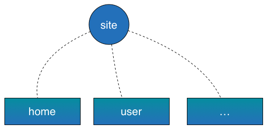
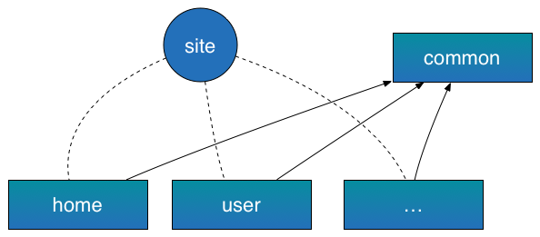
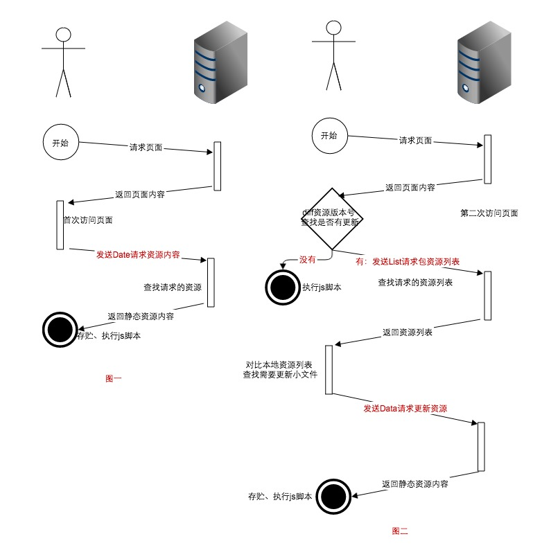

## 移动端前端解决方案

### 目录

- 介绍
- 目录规范
- 组件化
- 开发实战
    + 前后端分离
    + 资源合并、压缩
- 性能优化
    + manifest
    + 基于localStorage的静态资源差异化更新
    + 页面加载控制的优化
- 附录

### 介绍

### 目录规范

> 为什么要指定目录规范，如何指定目录规范是合适的，移动、pc都需要关注。

随着团队、项目越来越大，代码也随着变多。维护一套统一的目录规范是很重要的。统一的目录结果有很多好处，除了方便维护还可以通过工具来做一些自动化的工作。

在整个站点中，业务扩张后可能分为若干个子系统，比如用户子系统、支付子系统、分类子系统等。为了业务迭代，一般都会子系统单独功能升级，当然代码也就得按照子系统划分。假设我们把一个子系统的代码维护在一个svn下，并且用一个模块来标识一个子系统。这样一个站点就由多个子系统构成。

代码按照模块来维护，比如`common`、`account`等。

这样我们的一个站点的代码功能组织结构如下图；



当代码分成模块后，发现有些代码各个模块都需要用，那这个时候就会出现一个`common`模块来负责关心公共部分的代码。

当后续上线的时候，其他模块依赖于`common`模块即可，比如当给用户子系统添加功能时，抽象出了一些公共组件或者功能模块需要放到`common`里，那这时候上线的时候就需要关心两个模块`common`和用户子系统模块。

具体示例图如下；



上面已经说过，一个模块代码放入一个SVN仓库是比较理想的，这样一来模块就可以独立进行开发，不与其他模块相互牵扯，还可以减少代码分支合并冲突。

一个站点的代码分成多个模块进行维护，那模块里面应该怎么样组织会比较好一点呢？

在说明模块的目录规范时，需要引入`组件`的概念；组件就是一个功能或展现块。比如一个搜索框、一个导航抑或是专门负责地理位置处理的逻辑功能块。

一个页面可以分成若干组件，这时候目录就可以指定为；

- page
- widget

page下放置页面模板，而widget下放置所有的组件。page中include各个组件来拼出一个完整的页面。组件里面可以包含图片、js、css、模板等静态资源。

可能还会用到第三方库，比如`jquery`比如`960`，或者网站的ICO文件，这些放到组件里面可能不太合适，所以一般会有一个`static`目录来负责这些资源。

- page
- widget
- static

这样，模块内的目录结构就成型了。

```bash
.
├── page
├── static
└── widget
```

上面没有提到的几个问题；

- page里面是否需要放静态资源？

    一般来说，page里面都是一些页面模板，而会把一些用到的静态资源放到`widget`或者`static`下面。

- 展现块和功能块都包含那些静态资源？

    展现块包括模板，修饰模板的css还有js或者图片等叫`模板组件`，而功能块则是一些js、css、图片叫做`JS组件`。当然只有css和图片的组件叫做`css组件`

### 组件化

> 组件化或者模块化

站点拆成了模块，模块拆解成了很多页面，页面又由若干组件组成。这样的一个结果确实对维护很友好，就像拆解函数一样，每一个组件都做一项职责单一的工作。

当功能被拆分为各种组件，则会面临两个问题

0. 拆分成组件，务必会导致多了很多分散的静态资源文件，也就多了很多浏览器请求。
0. 为了复用性，可能需要提供一种机制搞定组件之间依赖的问题。就好比定义了好多函数，函数之间互相可以调用的方法。

#### JS组件

对于第一个问题，不得不对多个小文件进行合并。当合并的时候问题就出来了，JS代码变量发生冲突了，可能还会出现依赖顺序问题。每次需要通过精确的打包顺序和以及严格的变量命名规范才能搞定这个事情，当然规范的这种方式就显得太拙劣了一点，因为我们没办法保证每个人都会遵循规范。

干脆直接把代码写到一个匿名的`function`里面；

```javascript
(function() {
    var f = 0;
    ...
})();
```
这样解决了变量冲突的问题；

对于第二个问题，组件之间依赖的问题，可以效仿`node`的做法。在node里面，使用`require`来引入使用另一个组件。比如有a，b两个组件；其中a组件依赖b组件。这时候，在a里面就会这么写。

```javascript
//a.js
var b = require('b');

b.init();
b.run();

```

```javascript
//b.js
exports = {
    init: function() {

    },
    run: function() {

    }
};
```
其实对于每个组件，node会包裹一层函数，也就是上面提到的方法，不过为了解决更多的问题，包裹的方式不太一样。

实际上`b`组件应该是这个样子的。

```javascript
(function (exports, require, module, __filename, __dirname) {
    exports = {
            init: function() {
            },
            run: function() {
            }
    };
});
```

仔细看，就会发现这个`function`没有自执行。一般都是当`require`这个组件的时候再执行。进展到这儿可能需要理一下头绪了。

> 为了复用性和维护性 -> 拆解组件 -> 组件依赖、合并问题 -> 定义组件、引入`require`

基于node的思考，前端js组件也是可以使用相同的思路。组件包裹`function`然后在另一个组件里面用`require`来调用这个组件。现在有很多这类的规范，比如amd、cmd，也有很多实现require.js，mod.js，sea.js等。

而唯一不同的是，定义组件引入`define`函数；可以参见[AMD规范文档](https://github.com/amdjs/amdjs-api/blob/master/require.md)。

定义组件是这个样子的；

```javascript
define(function (require, exports, module) {
    //the require in here is a local require.
});
```

这样定义组件，可见的一个问题就是无法辨别组件，因为都是匿名函数，不可分辨。唯一能用来标识的就是文件的路径。但是这些文件是要合并到一起的，所以文件路径也不好使。好在有很多方法可以解决，可以参见AMD规范。

FIS `mod.js`的做法。

```javascript
define (id, function (require, exports, module) {
    //
})
```

用唯一的`id`标识每一个组件。明显，当JS组件都合并到一起后一点问题都没有。就像定义的一个个函数，给每一个函数取上了不同的名字，它们是唯一的存在的。

当然，这时候你会问，唯一的名字不也需要通过规范来写吗？当然不是，这会需要换一种思路来解决这个问题，工具自动根据路径来生成一个ID，轻松搞定这个问题。有自动化工具的接入，直接解决ID可能冲突的问题，当然必须这也是FIS的一个特色。

#### css组件

当然了，css的合并就显得轻松多了。因为它不会出现变量冲突直接挂掉页面，唯独有的就是可能选择器相同导致样式覆盖，但这个问题还是很容易解决的。加个统一的前缀了，使用less等变种语言啦。都可以很好的解决。

css组件依然需要关注的是，依赖问题。其实有的时候，css也是需要依赖的，至于为什么，后面会详细讲到。

css依然可以通过提供`require`来解决。比如，FIS的核心三种语言里面的。

```css
/**
 * @require a.css
 */
```

#### 模板、html

模板可能就不会遇到合并的问题了，所以依然是依赖问题比较明显一点。在整个解决方案中，我们选择提供的是Smarty模板。方案中使用Smarty插件的机制，提供了一种调用其他组件的方式。

```smarty

```

这样，就能很简单的调用其他组件了。

### 开发实战


> 使用后端模板渲染而非前端模板
> 充分利用缓存，保证整体站点的性能最优
> 合理减少资源请求


确定了目录规范以及如何模块化，定义了哪些可以当成一个组件哪些，整个项目可以按照上面提到的对前端代码做模块化拆分。前端代码已经拆解的比较清晰明了了。现在要确定的一个问题是如何跟后端结合，如何才能使整个项目开发更高效。


#### 前后端分离

> 由前端开发人员直接实现后端模板，而通过`数据`作为契约的开发模式是我们推崇的，当然更推崇前端开发人员接手整个UI层。

考虑一下前端开发和后端结合的情况，按照经验看，基本可以分为
- A类，前端开发人员负责写好页面、样式以及交互逻辑，后把产出的`html`、`css`、`js`等静态资源交给后端人员进行嵌入模板。
- B类，前端开发人员直接写好模板交给后端渲染。
 
在整个开发中，FIS推荐并且实现的是对B类开发的支持。当然A类是很常见的，很多公司自由组织或者个人开发都是这种方式。以下就扒一扒这两类的优缺点以及说明为什么选择B类。

A类开发有个严重的缺点是，整个项目前端开发和后端开发是串行的，这无疑对生产力造成了很大的影响。不过其有个好处是整个过程简单粗暴。

B类开发呢，好处自不必说，前后端可以并行开发；前端开发模板，后端只提供数据，这种模式的一个缺点就是前后端需要以`数据`为契约。导致的一个直接后果是，前端人员开发的时候需要一个模拟环境来保证开发的效率。

在产品规模比较大的时候，A类已经不怎么适用了，严重影响`debug`的时间，特别是迭代很快的情况下，UI可变性很高，这就更有必要使用B类来满足需求。

也说到了B类需要用`数据`来做契约，一个页面展示的`数据`相对于来说比较固定，在设计阶段可以基本确定。剩下就是本地的开发模拟环境了，FIS的特性之一`辅助开发`即为此类提供服务，FIS提供了一套完整的本地模拟环境，具体可以参见[文档](http://fis.baidu.com)。

#### 资源合并、压缩

> 合理合并静态资源，以求性能达到最大，是我们追求的目标
> - 请不要把太大的图片以base64的方式内联

##### 压缩

- js文件压缩
    + js压缩一般选用[UglifyJS][uglifyjs]作为压缩工具
- css文件压缩
    + css压缩一般选用[clean-css][clean-css]作为压缩工具
- html文件压缩
    + html建议不要压缩
        * 收益非常非常小。大多数产品线线上都开启了gzip，线下压缩相当多余，最后送达到用户浏览器的html大小没差别
        * 现在没有一个比较好的压缩工具能保持压缩前后效果相同
- 图像压缩
    + `pngquant`和`pngcrush`用来压缩`png`图片
    + `jpegtran`用来压缩`jpeg`图片

FIS中已经集成了各种压缩工具，只需要在编译是添加编译选项`-o`即可。如，

```bash
fis release -r <to-project-path> -o -d <to-output-path>
```

##### 合并

[目录规范](#目录规范) 这节主要讲述了为了维护等方面的考虑，进行了[模块化](#模块化)拆分，拆分以后就遇到了文件散列的问题。所以需要合并这些资源，来使页面加载更快速。

合并这块就不多说了，可以参见[fis](http://fis.baidu.com)文档查看详细的配置方式。

不过这块需要说明的是，在合并的过程中，需要考虑到整站的性能和关键页的性能，而不要一味的追求每一个页面的性能最优。

### 性能优化


> 性能优化已经是个细活，FIS提供足够的优化空间。可以从缓存、加载页面控制、请求控制等方面着手优化。
> 通过`监控`页面加载的细节，调整静态资源的加载时机及其顺序，能有效的提升性能。

+ manifest
+ 基于localStorage的静态资源差异化更新
+ combo
+ 自动打包
+ 页面加载控制的优化

通过合并可以减少请求数，通过压缩可以减少请求的字节大小，这些都是通过减少请求资源来达到性能优化的目的。本节主要讨论如何通过缓存、页面加载控制、统计来做性能优化。

#### manifest

manifest更新后第二次才能生效，所以不建议使用，不过其能很牛掰的把页面也给缓存，所以，请合理利用。

#### 基于localStorage的静态资源差异化更新

> 增强缓存利用率，有效的减少请求资源大小

localStorage 作为浏览器端本地存储的手段，其高效瞬存瞬取已经被世人所知。如果使用它来做静态资源的缓存，能使缓存使用率提高很多。一般浏览器的缓存大概在60%左右，但由于需要合并资源，可能其中一个文件改变就导致整包加载，缓存失效。本节主要介绍如何用`localStorage`来做资源的差异化更新，也就是解决上面遇到的这个问题。

可以再瞄一下上面的描述，为了`减少请求`需要打包，包文件在包含的任何一个资源发生变化后就会导致整个包需要被请求一次。这种情况很容易出现，这在快速迭代时更明显。

对于这个问题，本方案的解决方式是用`localStorage`保存静态资源的内容。这块的内容不是讲整个内容保存进去，而是被打包文件内容的列表，每条内容附带一个版本号；有了这个版本号，就可以一定的方式`diff`出需要变更的资源。然后请求回来更新`localStorage`的缓存。

大致就如文字描述，但是里面有很多细节，以下是整个方案的详细实现。



- 图一是当用户首次访问没有缓存的资源更新流程

    从图一中可以看出首次访问的用户资源更新需要发送1个请求

- 图二是非首次访问用户的资源更新流程

    从图二可以看出非首次访问的用户资源更新需要发送0个或者2个请求

上图描述了整个方案的细节，可以看出，通过前端`loader`来接管资源的渲染、加载。即可引入`localStorage`存储阶段。

#### 页面加载控制的优化

页面加载的各种性能优化手段，分别是`bigrender`、`bigpipe`、`lazyrender`。

- `bigrender` 一种减少首屏dom节点优化首屏展现的方案；
- `bigpipe`  一种通过chunk输出来优化网页展现的方案；
- `quickling` 一种加载页面的模式，页面的一个局部可以通过异步请求，请求数据包括渲染好的页面以及静态资源；
- `lazyrender` 手机上可能网络传输很慢，如果先传输一部分过来展示，然后再根据用户的操作输出剩下的部分，无疑是可以提高首屏时间的。整个方案就命名为`lazyrender`

##### bigrender

详细说一下bigrender如何实现的，一个页面可能占几屏，首先出现在用户视野里的自然是第一屏。一次渲染如果把所有都渲染，无疑需要比较长的时间，这时候用户无法操作界面甚至于无法看到页面。bigrender的思路是这样的；

+ 先渲染首屏，其余的部分的html被放到注释里面（或`textarea`），这样就保证不被渲染，较少首屏时间。
+ 当用户向下查看次屏的内容时，再触发脚本渲染次屏的内容。
+ 依次展现整个网页

##### bigpipe

bigpipe对服务器要求比较高，需要支持chunk输出。其实就是在同一个链接上将一个页面分段输出。需要服务器端能并行处理页面，假设页面可以分为三屏，没屏都对应一些数据。当某一屏的数据获取成功，其可以马上返回给浏览器（也就是pipe的方式输出），这样对应的屏就展现出来了。如果支持并行处理，再以chunk的方式输出，无疑会让浏览器加载展现会快很多。

对于上面说的举个例子；假设页面分为三部分A，B，C，A的数据是调用后端服务层`api_a`得到，B是`api_b`，C是`api_c`。

_node.js示例_

```javascript
var asyncMap = require('slide').asyncMap;
var app = require('express')();

app.get('/', function (req, res) {
    //并行处理
    asyncMap(
        [
            "http://api.xxx.com/api_a",
            "http://api.xxx.com/api_b",
            "http://api.xxx.com/api_c"
        ],
        function(url, cb) {
            http.get(url, function(r) {
                var d = '';
                r.on('data', function (c) { d += c.toString(); });
                r.on('end', function() {
                    res.write(d); //直接输出
                    cb(null, '');
                });
            });
        },
        function(err, r) {
            res.end();
        };
    );
});

app.listen(3000);
```
上面就是一个并行化的例子，当然了如果不是api调用，查询数据库也是同样的道理。

可能会有这样的疑问，如何精准控制页面的展现。比如可能第二屏先出来，导致用户看到的是第二屏，而第一屏跑到了第二屏下面；其实这个已经有成型的解决方案了，比如facebook，微博等都实现了bigpipe。

解决上面问题的大致思路是，先给浏览器吐一个结构。

```html
<html>
    ...
    <div id="first"></div>
    <div id="second"></div>
    ...
</html>
```
然后在html结束后，输出一些js代码来渲染内容上去；比如

```html
<html>
    ...
    <div id="first"></div>
    <div id="second"></div>
    ...
</html>
<script>render('first', function() {/*first内容*/});</script> <!-- 第一次chunk -->
<script>render('second', function() {/*second内容*/});</script> <!-- 第二次chunk -->
```
这样就完美搞定页面渲染的问题，并且提升了不少性能，一个部分一个部分渲染的嘛~

##### lazyrender

在手机网络下，html如果太大，会传输很长时间。这时候如果把页面拆解为几部分然后分块请求，将有利于页面的展示。当然了，如果后端比较龟速，分成几块也可以使用相同的方式去加快页面的展现。

lazyrender就是这个思路。大概做法就是，当页面渲染的时候，把首屏先传输给浏览器进行展示，其他屏或者不重要的东西给页面打一段js。大概是这个样子的；

```html
<html>
    ...
    <div>首屏代码</div>
    <script>lazyrender('second');</script>
    ...
</html>
```

当首屏展现完成后，可以触发次屏的加载。使用quickling的方式加载次屏的html，css，js等然后进行渲染。


### 附录

- fis, http://fis.baidu.com

----
[jquery]: http://jquery.com "jquery"
[UglifyJS]: / "uglifyjs"
[clean-css]: / "clean-css"
